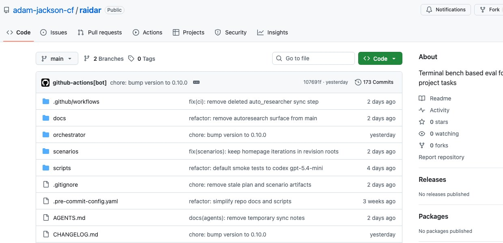

# RAIDAR is an opinionated framework for delivery evaluation decisions

Most evaluation tooling in AI still answers the wrong question for software delivery.

It tells you whether a model did well on a benchmark, whether a prompt variant scored higher, or whether an agent completed a task in a controlled environment.

Those are useful signals. But they aren't the decision I usually need to make.

What I actually want to know is:

- which harness + model pair should I trust for this kind of delivery task?
- where did the run fail: functional correctness, acceptance, verification, execution quality, stability?
- what should I change next: prompt, rules, starter, scenario design, harness choice, or model choice?

That's the space RAIDAR is aimed at.

RAIDAR is not a generic LLM eval toolkit. I built it as an opinionated framework for **delivery evaluation decisions**.

The core unit is not just a prompt or a benchmark item. It's a **delivery scenario** plus an **`AgentSpec`**, where `AgentSpec = harness + model`.

That distinction matters more than it sounds.

The repository is here: [adam-jackson-cf/raidar](https://github.com/adam-jackson-cf/raidar).

## Why I think this framing matters

If you're evaluating real project work, the model is only part of the behaviour.

The runtime surface matters. The harness matters. The rules and starter context matter. The verification setup matters. The repeatability of the outcome matters.

I've found that once you move from "can this model solve a toy task?" to "can I use this setup to make delivery decisions?", a lot of the current tooling stops just short of what you need.

You need an explicit scenario contract.
You need repeated experiment runs.
You need evidence bundles that help explain why something worked or failed.
And you need to treat the harness as an experimental variable, not just a transport layer around the model.

That's the bit most tools still miss.

## What RAIDAR is opinionated about

RAIDAR is opinionated in a few specific ways.

First, it is **delivery-first**.

The scenario is meant to look like real project work: prompt, rules, starter, verification settings, acceptance requirements, metrics, and optional visual reference where that matters.

Second, it is opinionated about the **decision surface**.

I'm not only interested in whether something "passed". I want to understand whether a run is good enough to support a delivery choice:

- Is it functionally correct?
- Does it satisfy the stated acceptance?
- Are the verification signals trustworthy?
- Is the execution valid, or did it succeed for the wrong reasons?
- Is the result stable enough across repeats to rank?
- Where relevant, does it stay close enough to the intended visual outcome?

Third, it is opinionated about the **improvement loop**.

The output should help answer what to change next. Not in the abstract, but concretely:

- change the prompt
- tighten the rules
- improve the starter
- redesign the scenario
- switch the harness
- switch the model

That is very different from a benchmark leaderboard or a prompt-testing matrix, even if some of the underlying mechanics look similar.

## What RAIDAR can answer that generic eval tooling often can't

For me, the useful questions are things like:

- Which harness + model pair is the best fit for this delivery task?
- Which setup is most stable across repeated runs?
- Is the result genuinely acceptable, or did it get through verification in a brittle way?
- Is this a model problem, a harness problem, or a scenario-design problem?
- Which changes improve delivery performance consistently rather than anecdotally?

That's why I describe RAIDAR as a framework for delivery evaluation decisions rather than simply "an eval framework".

## How it compares to other frameworks

I recently did a structured comparison of RAIDAR against [Inspect AI](https://github.com/UKGovernmentBEIS/inspect_ai), [Promptfoo](https://github.com/promptfoo), and [DeepEval](https://deepeval.com/docs/getting-started).

All three are good tools. They just solve different parts of the problem.

### Inspect AI

[Inspect AI](https://inspect.aisi.org.uk/) is the closest architectural comparison point.

If I wanted the best open-source reference for reusable tasks, execution plans, scorers, retries, logs, and multi-model evaluation sets, this is where I'd start. It has the cleanest shape for structured evaluation work, and it comes closest to RAIDAR in terms of framework design.

Where RAIDAR still differs is in how explicitly it centers the delivery scenario and the harness + model pair as the thing being evaluated.

Inspect is the nearest analogue.
It is not the same thing.

### Promptfoo

[Promptfoo](https://www.promptfoo.dev/docs/intro/) is the best lightweight comparison point.

It is very strong if what you want is side-by-side comparison, custom assertions, quick iteration, coding-agent evaluation, and a practical feedback loop you can use quickly in CI or locally.

If the question is "how do I compare a lot of variants efficiently?", Promptfoo is very good.

If the question is "how do I make decision-grade delivery judgements from scenario runs where the harness itself is part of the experiment?", RAIDAR is more opinionated in the right place.

### DeepEval

[DeepEval](https://deepeval.com/docs/getting-started) is the best companion evaluation layer of the three.

It is strongest on evaluators, metrics, tracing, regression-style checks, and metric composition. That is valuable. In fact, that kind of capability is often exactly what you want around a delivery evaluation system.

But I wouldn't frame it as a direct replacement for RAIDAR.

The centre of gravity is different. DeepEval is strongest when you already have an application or runner and want better evaluators around it. RAIDAR is strongest when the missing piece is the delivery scenario and the harness/model comparison itself.

## The real differentiator

The clearest differentiator surfaced by the comparison work was simple:

**RAIDAR makes `AgentSpec = harness + model` a first-class concept.**

That sounds small, but it changes the shape of the whole system.

It forces the framework to care about delivery behaviour, not just output scoring.
It forces repeated comparisons to be structured around actual execution setups.
And it makes the result more useful for teams trying to decide what to trust in delivery rather than what happens to score well in isolation.

That is the position I think is missing from a lot of current evaluation tooling.

## Where I think this goes next

RAIDAR is still early, and I don't think the current shape is the end state.

Two things I want to push next are:

- a **web-based review surface** so the evidence and comparisons are easier to inspect, discuss, and act on
- **autoresearch-inspired experiment handling** so experiment setup, iteration, and follow-on investigation become more systematic

That's the direction I'm interested in: not just more evals, but better ways to make delivery decisions from them.

If you're working in this space, I'd be interested in whether you're seeing the same gap.

The benchmark story is getting better.
The prompt-testing story is getting better.
The metrics story is getting better.

But the workflow for deciding which AI setup should be trusted for real delivery work still feels underbuilt.

That's the thing RAIDAR is trying to get to.
